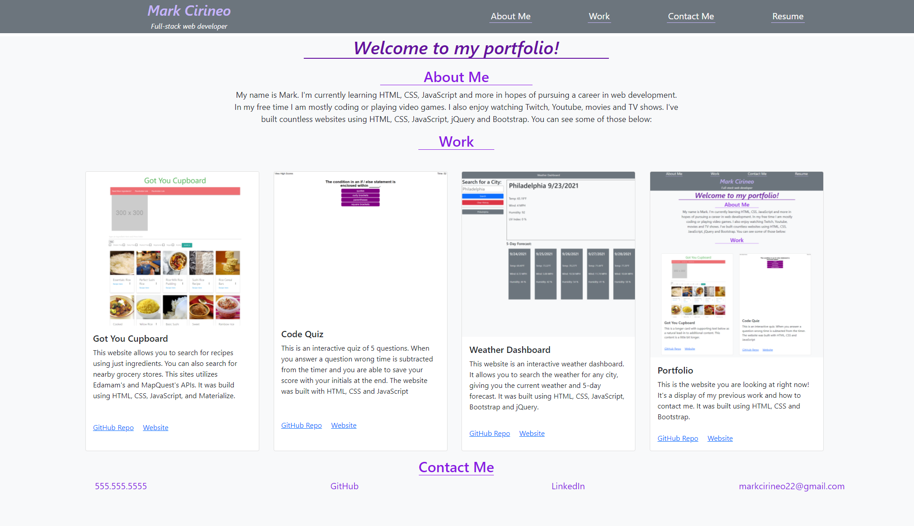

# Portfolio

## Description
This website is a portfolio of all my previous work. It serves as a place employers can view my previous work to assess my skills as a potential employee. It was built using HTML and CSS.

## Table of Contents (Optional)
- [Installation](#installation)
- [Usage](#usage)
- [Credits](#credits)
- [Features](#features)
- [How to Contribute](#how-to-contribute)
- [Tests](#tests)
## Installation
N/A
## Usage
Visit the website here: https://markcirineo.github.io/Portfolio/

## Credits
resest.css taken from https://upenn.bootcampcontent.com/upenn-bootcamp/upenn-virt-fsf-ft-08-2021-u-lol
## Features
If your project has a lot of features, list them here.
## How to Contribute
You can contact me here: markcirineo22@gmail.com
## Tests
N/A